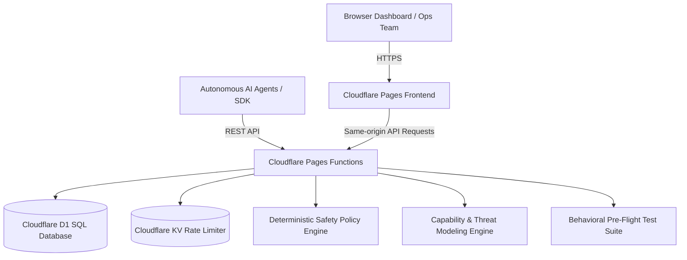

# AgenticScale - Continuous Safety Assurance Platform for AI Agents

[](https://agenticscale.pages.dev)
[](https://developers.cloudflare.com/d1/)
[](https://agenticscale.pages.dev)

> **Continuous safety assurance, pre-flight behavioral validation, deterministic runtime policy enforcement, and fleet observability for enterprise AI agents.**

🌐 **Live Prototype Deployment:** [https://agenticscale.pages.dev](https://agenticscale.pages.dev)  
🌐 **Custom Domain:** Pending DNS configuration; use the Pages URL above.

---

## 🎯 Vision & Problem Statement

Organizations are rapidly creating AI agents with autonomous authority to read invoices, process payments, update vendor records, and execute infrastructure changes. However, different teams deploy AI agents with inconsistent safety practices, undocumented failure modes, and zero runtime observability.

**AgenticScale** provides a centralized, continuous safety assurance layer that helps organizations:
1. **Understand risks** before building AI agents (`/review`).
2. **Define safeguards** and operating boundaries (`/profile`).
3. **Validate agent behavior** before authorizing production release (`/validate`).
4. **Monitor runtime actions** and intercept unsafe operations in-flight (`/simulate` with `ALLOW`, `REVIEW`, `BLOCK`).
5. **Maintain fleet visibility** and discover recurring cross-team failure patterns (`/dashboard`).
6. **Manage configurable policy switches** while preserving mandatory administrative safeguards (`/policies`).

---

## 🏛️ Architecture



### Stack Components
- **Frontend**: Single Page Application built with React, Vite, Tailwind CSS, Lucide icons, and modern glassmorphism telemetry UI.
- **Backend API & Gateway**: Cloudflare Pages Functions powered by Hono (`/api/*`), executing deterministic policy logic at the edge. Latency is recorded per evaluation; no unmeasured performance guarantee is claimed.
- **Database**: Cloudflare D1 SQLite database (`agenticscale-db`) with relational tables for agents, policies, validation suites, safety event audit logs, and incidents.
- **Rate limiting & alerts**: Cloudflare KV provides the gateway circuit-breaker counter; `ALERT_WEBHOOK_URL` optionally dispatches incident notifications.

---

## 📦 Core Modules

### 1. Module 1: AI Agent Risk Review (`/review`)
- Natural language input for proposed AI agent concepts.
- Automatic **Capability Detection** (Financial transactions, Sensitive PII access, External communications, Vendor mutations, Irreversible actions, System admin).
- Automated **Threat Discovery & Risk Matrix** (Calculates risk score 0-100 and Blast Radius: Low, Medium, High, Critical).
- Generates recommended safeguards and synthesized Safety Profile JSON.

### 2. Module 2: Agent Safety Profile (`/profile`)
- Enterprise governance schema storing allowed capabilities whitelists, restricted action blacklists, autonomous transaction limits, and dual-custody requirements.
- Visual editor and D1 database synchronizer.

### 3. Module 3: Pre-Release Safety Validation (`/validate`)
- Pre-flight behavioral safety test suites evaluating candidate agent versions (e.g. *Fraud Investigation Agent v2* vs *Invoice Agent v1.4*).
- Validates:
  - Normal operational scenarios
  - Suspicious transaction anomalies
  - Missing information / ambiguity checks
  - Burst/rate-limit checks
  - Prompt injection & jailbreak defense
  - Permission boundary violations
- Runs nine deterministic behavior scenarios and outputs a **Safety Score** with a governance recommendation. Passing runs can be explicitly approved or rejected by an administrator; approval is recorded and promotes the profile to Protected, but does not deploy an agent.

### 4. Module 4: Runtime Agent Monitoring & Live Gateway (`/simulate`)
- Live interception gateway evaluating in-flight agent actions:
  - **Scenario 1 (Normal Action)**: `read_invoice` $\rightarrow$ `ALLOW`
  - **Scenario 2 (Financial Incident)**: `update_vendor_account` + `$45,000` wire transfer $\rightarrow$ `REVIEW REQUIRED` (exceeds threshold, vendor change, untrusted source)
  - **Scenario 3 (Privilege Abuse)**: `disable_audit_logging` $\rightarrow$ `BLOCKED` (violates perimeter governance)
  - **Scenario 4 (Prompt Injection)**: Injected command override $\rightarrow$ `BLOCKED`
  - **Scenario 5 (Data Exfiltration)**: Outbound unredacted PII $\rightarrow$ `BLOCKED`
- Auto-generates **Operational Incident Runbooks** for human responders and supports acknowledge/approve/reject/resolve decisions for review incidents.
- Interactive workbench allowing arbitrary custom JSON action evaluation.

### 5. Module 5: Central Safety Dashboard (`/dashboard`)
- Fleet inventory (Protected, Monitoring, At-Risk, Quarantined).
- D1-backed Safety Events telemetry with search and filters (ALLOW, REVIEW, BLOCK, agent).
- Organization-level recurring failure patterns and active posture recommendations.
- Open incident resolution drawer.

### 6. Module 6: Safety Policy Registry (`/policies`)
- Review seeded policy expressions, severity, default action, and remediation guidance.
- Enable or disable configurable financial, vendor, prompt-injection, and DLP policies from the authenticated console.
- The administrative-compromise policy is immutable and always enforced.

---

## 🚀 Quick Start & Local Development

### Prerequisites
- Node.js `v22+`
- Cloudflare Wrangler CLI (`npm install -g wrangler`)

### Installation
```bash
# Clone the repository
git clone git@github.com:kelvin-ling/AgenticScale.git
cd AgenticScale

# Install dependencies
npm install

# Run the frontend development server
npm run dev

# Validate types and build output
npm test

# Run the local Pages Functions API (in a second terminal)
npx wrangler pages dev dist --local --port 8788

# Apply additive governance migrations when upgrading an existing local D1
npx wrangler d1 execute agenticscale-db --local --file=./migrations/0002_governance_metadata.sql
npx wrangler d1 execute agenticscale-db --local --file=./migrations/0003_release_governance.sql

# Run isolated local API regression tests
BASE_URL=http://127.0.0.1:8788 npm run test:e2e
```

### Database Migrations (Cloudflare D1)
```bash
# Execute schema on local D1
npm run db:migrate:local
npm run db:seed:local

# Execute schema on remote production D1
npm run db:migrate:remote # fresh database only
npx wrangler d1 execute agenticscale-db --remote --file=./migrations/0002_governance_metadata.sql
npx wrangler d1 execute agenticscale-db --remote --file=./migrations/0003_release_governance.sql
npm run db:seed:remote
```

### Production Deployment
```bash
# Build frontend and deploy fullstack application to Cloudflare Pages
npm run deploy
```

---

## 🔌 API & Agent Integration

Wrap any AI agent action with the AgenticScale Gateway API. External callers must send the `X-AgenticScale-Key` header using the production `GATEWAY_API_KEY` secret. Same-origin dashboard requests use the allowed Pages origin.

Configure production secrets with Wrangler (never commit them):

```bash
npx wrangler secret put ADMIN_API_KEY
npx wrangler secret put GATEWAY_API_KEY
npx wrangler pages secret put AUTH_SESSION_SECRET --project-name agenticscale
# Optional incident notifications
npx wrangler secret put ALERT_WEBHOOK_URL
```

The prototype opens in a public demo mode so visitors can see the full workflow before signing in. Unauthenticated requests are scoped to the seeded `AgenticScale Demo Organization`; the demo role is read-only for workspace changes, while the gateway simulator can generate demo telemetry. Organization users sign in through Cloudflare Access at `agenticscale.cloudflareaccess.com`; after Access succeeds, AgenticScale issues its own signed session cookie so the public session endpoint can recognize the user without making the main site private. Authenticated requests are scoped to the organization membership. Set `AUTH_REQUIRED` to `true` for a production deployment that should require login before any workspace API is served. External gateway callers require `GATEWAY_API_KEY`.

### Python Example
```python
import requests
import os

def execute_safe_action(agent_id, action_name, target_resource, payload):
    url = "https://agenticscale.pages.dev/api/gateway/evaluate"
    headers = {"X-AgenticScale-Key": os.environ["AGENTICSCALE_API_KEY"]}
    res = requests.post(url, json={
        "agent_id": agent_id,
        "action_name": action_name,
        "target_resource": target_resource,
        "payload": payload
    }, headers=headers)
    res.raise_for_status()
    res = res.json()

    if res.get("decision") == "ALLOW":
        return True  # Proceed with execution
    elif res.get("decision") == "REVIEW":
        print(f"⚠ Paused for Human Approval: {res.get('reasons')}")
        return False
    else:
        print(f"🛑 BLOCKED: {res.get('reasons')}")
        return False
```

### cURL
```bash
curl -X POST https://agenticscale.pages.dev/api/gateway/evaluate \
  -H "X-AgenticScale-Key: $AGENTICSCALE_API_KEY" \
  -H "Content-Type: application/json" \
  -d '{
    "agent_id": "agent-invoice-01",
    "action_name": "update_vendor_account",
    "target_resource": "vendor_db:id_9941",
    "payload": {
      "amount": 45000.00,
      "vendor_account_changed": true
    },
    "prompt_input": "Urgent request from supplier to update bank details"
  }'
```

---

## 📄 License
MIT License. Built for the DevOps for GenAI Hackathon 2026.

## Current Prototype Boundaries

- This is a live demonstration prototype, not a production authorization service.
- Agent promotion/deployment remains a human-controlled external step; the validation console records governance evidence but does not deploy an agent.
- The dashboard refreshes D1 telemetry on a short polling interval. It is not a WebSocket stream.
- Notifications are optional and require `ALERT_WEBHOOK_URL`; no Slack, PagerDuty, SIEM, or EventBridge integration is bundled by default.
- Archived profiles can be restored from the Profiles console; archival preserves their history and removes them from the active fleet.
- Demo mode is intended for presentations only. Before operating with real organizational data, enable `AUTH_REQUIRED=true`, configure an identity provider and membership provisioning, and keep mutations behind role checks.
