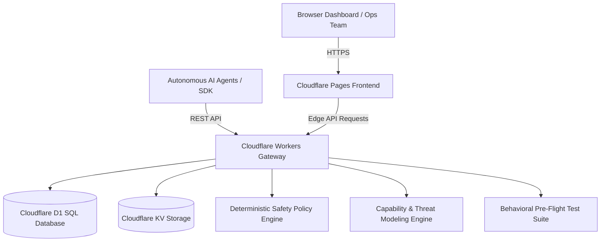

# AgenticScale - Continuous Safety Assurance Platform for AI Agents

[](https://agenticscale.pages.dev)
[](https://developers.cloudflare.com/d1/)
[](https://agenticscale.pages.dev)

> **Continuous safety assurance, pre-flight behavioral validation, deterministic runtime policy enforcement, and fleet observability for enterprise AI agents.**

🌐 **Live Prototype Deployment:** [https://agenticscale.pages.dev](https://agenticscale.pages.dev)  
🌐 **Custom Domain:** [https://agenticscale.org](https://agenticscale.org)

---

## 🎯 Vision & Problem Statement

Organizations are rapidly creating AI agents with autonomous authority to read invoices, process payments, update vendor records, and execute infrastructure changes. However, different teams deploy AI agents with inconsistent safety practices, undocumented failure modes, and zero runtime observability.

**AgenticScale** provides a centralized, continuous safety assurance layer that helps organizations:
1. **Understand risks** before building AI agents (`/review`).
2. **Define safeguards** and operating boundaries (`/profile`).
3. **Validate agent behavior** before authorizing production release (`/validate`).
4. **Monitor runtime actions** and intercept unsafe operations in-flight (`/simulate` with `ALLOW`, `REVIEW`, `BLOCK`).
5. **Maintain fleet visibility** and discover recurring cross-team failure patterns (`/dashboard`).

---

## 🏛️ Architecture



### Stack Components
- **Frontend**: Single Page Application built with React, Vite, Tailwind CSS, Lucide icons, and modern glassmorphism telemetry UI.
- **Backend API & Gateway**: Cloudflare Pages Functions powered by Hono (`/api/*`), executing deterministic policy logic at the edge in sub-15ms.
- **Database**: Cloudflare D1 SQLite database (`agenticscale-db`) with relational tables for agents, policies, validation suites, safety event audit logs, and incidents.
- **Cache & Config**: Cloudflare KV for high-speed edge policy cache.

---

## 📦 Core Modules

### 1. Module 1: AI Agent Risk Review (`/review`)
- Natural language input for proposed AI agent concepts.
- Automatic **Capability Detection** (Financial transactions, Sensitive PII access, External communications, Vendor mutations, Irreversible actions, System admin).
- Automated **Threat Discovery & Risk Matrix** (Calculates risk score 0-100 and Blast Radius: Low, Medium, High, Critical).
- Generates recommended safeguards and synthesized Safety Profile JSON.

### 2. Module 2: Agent Safety Profile (`/profile`)
- Enterprise governance schema storing allowed capabilities whitelists, restricted action blacklists, autonomous transaction limits, and dual-custody requirements.
- Visual editor and D1 database synchronizer.

### 3. Module 3: Pre-Release Safety Validation (`/validate`)
- Pre-flight behavioral safety test suites evaluating candidate agent versions (e.g. *Fraud Investigation Agent v2* vs *Invoice Agent v1.4*).
- Validates:
  - Normal operational scenarios
  - Suspicious transaction anomalies
  - Missing information / ambiguity checks
  - Prompt injection & jailbreak defense
  - Permission boundary violations
- Outputs clear **Safety Score** and unambiguous release recommendations: `Approved for Production` vs `Do Not Automatically Release - 2 Issues Flagged`.

### 4. Module 4: Runtime Agent Monitoring & Live Gateway (`/simulate`)
- Live interception gateway evaluating in-flight agent actions:
  - **Scenario 1 (Normal Action)**: `read_invoice` $\rightarrow$ `ALLOW`
  - **Scenario 2 (Financial Incident)**: `update_vendor_account` + `$45,000` wire transfer $\rightarrow$ `REVIEW REQUIRED` (exceeds threshold, vendor change, untrusted source)
  - **Scenario 3 (Privilege Abuse)**: `disable_audit_logging` $\rightarrow$ `BLOCKED` (violates perimeter governance)
  - **Scenario 4 (Prompt Injection)**: Injected command override $\rightarrow$ `BLOCKED`
  - **Scenario 5 (Data Exfiltration)**: Outbound unredacted PII $\rightarrow$ `BLOCKED`
- Auto-generates **Operational Incident Runbooks** for human responders.
- Interactive workbench allowing arbitrary custom JSON action evaluation.

### 5. Module 5: Central Safety Dashboard (`/dashboard`)
- Real-time fleet inventory (Protected, Monitoring, At-Risk, Quarantined).
- Live Safety Events telemetry stream with search & filters (ALLOW, REVIEW, BLOCK).
- Organization-level recurring failure patterns and active posture recommendations.
- Open incident resolution drawer.

---

## 🚀 Quick Start & Local Development

### Prerequisites
- Node.js `v20+`
- Cloudflare Wrangler CLI (`npm install -g wrangler`)

### Installation
```bash
# Clone the repository
git clone git@github.com:kelvin-ling/AgenticScale.git
cd AgenticScale

# Install dependencies
npm install

# Run local development server
npm run dev
```

### Database Migrations (Cloudflare D1)
```bash
# Execute schema on local D1
npm run db:migrate:local
npm run db:seed:local

# Execute schema on remote production D1
npm run db:migrate:remote
npm run db:seed:remote
```

### Production Deployment
```bash
# Build frontend and deploy fullstack application to Cloudflare Pages
npm run deploy
```

---

## 🔌 API & Agent Integration

Wrap any AI agent action with the AgenticScale Gateway API:

### Python Example
```python
import requests

def execute_safe_action(agent_id, action_name, target_resource, payload):
    url = "https://agenticscale.org/api/gateway/evaluate"
    res = requests.post(url, json={
        "agent_id": agent_id,
        "action_name": action_name,
        "target_resource": target_resource,
        "payload": payload
    }).json()

    if res.get("decision") == "ALLOW":
        return True  # Proceed with execution
    elif res.get("decision") == "REVIEW":
        print(f"⚠ Paused for Human Approval: {res.get('reasons')}")
        return False
    else:
        print(f"🛑 BLOCKED: {res.get('reasons')}")
        return False
```

### cURL
```bash
curl -X POST https://agenticscale.org/api/gateway/evaluate \
  -H "Content-Type: application/json" \
  -d '{
    "agent_id": "agent-invoice-01",
    "action_name": "update_vendor_account",
    "target_resource": "vendor_db:id_9941",
    "payload": {
      "amount": 45000.00,
      "vendor_account_changed": true
    },
    "prompt_input": "Urgent request from supplier to update bank details"
  }'
```

---

## 📄 License
MIT License. Built for the DevOps for GenAI Hackathon 2026.
